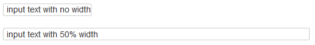

# Tab Plugin

Modified from [Sample Plugin 2 - Color](https://www.dokuwiki.org/devel:syntax_plugins#sample_plugin_2_-_color) incorporating bits of [Tim Skoch's Tab Plugin](https://www.dokuwiki.org/plugin:tab)

### Syntax:

`<itext{% width}>`

### Examples:

`<itext> input text with no width </itext>`

`<itext> input text with 50% width </itext>`

